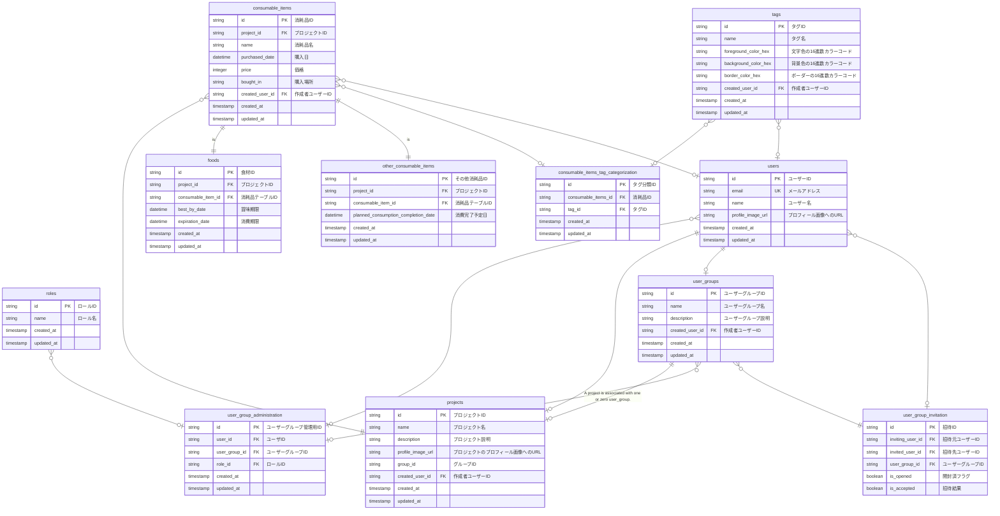

# ERD

```mermaid
erDiagram
  users {
    string id PK "ユーザーID"
    string email UK "メールアドレス"
    string name "ユーザー名"
    string profile_image_url "プロフィール画像へのURL"
    timestamp created_at
    timestamp updated_at
  }
  
  roles {
    string id PK "ロールID"
    string name "ロール名"
    timestamp created_at
    timestamp updated_at
  }
  
  user_groups {
    string id PK "ユーザーグループID"
    string name "ユーザーグループ名"
    string description "ユーザーグループ説明"
    string created_user_id FK "作成者ユーザーID"
    timestamp created_at
    timestamp updated_at
  }
  
  projects {
    string id PK "プロジェクトID"
    string name "プロジェクト名"
    string description "プロジェクト説明"
    string profile_image_url "プロジェクトのプロフィール画像へのURL"
    string group_id "グループID"
    string created_user_id FK "作成者ユーザーID"
    timestamp created_at
    timestamp updated_at
  }
  
  user_group_administration {
    string id PK "ユーザーグループ管理用ID"
    string user_id FK "ユーザID"
    string user_group_id FK "ユーザーグループID"
    string role_id FK "ロールID"
    timestamp created_at
    timestamp updated_at
  }
  
  user_group_invitation {
    string id PK "招待ID"
    string inviting_user_id FK "招待元ユーザーID"
    string invited_user_id FK "招待先ユーザーID"
    string user_group_id FK "ユーザーグループID"
    boolean is_opened "開封済フラグ"
    boolean is_accepted "招待結果"
  }
  
  consumable_items {
    string id PK "消耗品ID"
    string project_id FK "プロジェクトID"
    string name "消耗品名"
    datetime purchased_date "購入日"
    integer price "価格"
    string bought_in "購入場所"
    string created_user_id FK "作成者ユーザーID"
    timestamp created_at
    timestamp updated_at
  }
  
  foods {
    string id PK "食材ID"
    string project_id FK "プロジェクトID"
    string consumable_item_id FK "消耗品テーブルID"
    datetime best_by_date "賞味期限"
    datetime expiration_date "消費期限"
    timestamp created_at
    timestamp updated_at
  }

  other_consumable_items {
    string id PK "その他消耗品ID"
    string project_id FK "プロジェクトID"
    string consumable_item_id FK "消耗品テーブルID"
    datetime planned_consumption_completion_date "消費完了予定日"
    timestamp created_at
    timestamp updated_at
  }
  
  tags {
    string id PK "タグID"
    string name "タグ名"
    string foreground_color_hex "文字色の16進数カラーコード"
    string background_color_hex "背景色の16進数カラーコード"
    string border_color_hex "ボーダーの16進数カラーコード"
    string created_user_id FK "作成者ユーザーID"
    timestamp created_at
    timestamp updated_at
  }
  
  user_groups ||--o| projects : "A project is associated with one or zero user_group."
  
  users }o--o| user_group_administration : ""
  roles }o--o| user_group_administration : ""
  user_groups }o--o| user_group_administration : ""
  
  consumable_items }o--|| projects : ""
  
  consumable_items_tag_categorization {
    string id PK "タグ分類ID"
    string consumable_items_id FK "消耗品ID"
    string tag_id FK "タグID"
    timestamp created_at
    timestamp updated_at
  }
  
  consumable_items ||--|| foods : "is"
  consumable_items ||--|| other_consumable_items : "is"
  
  consumable_items }o--o| consumable_items_tag_categorization : ""
  consumable_items }o--o| users : ""
  tags }o--o| consumable_items_tag_categorization : ""
  tags }o--o| users : ""
  users ||--o| projects : ""
  users ||--o| user_groups : ""
  users }o--o| user_group_invitation : ""
  user_groups }o--|| user_group_invitation : ""
```
